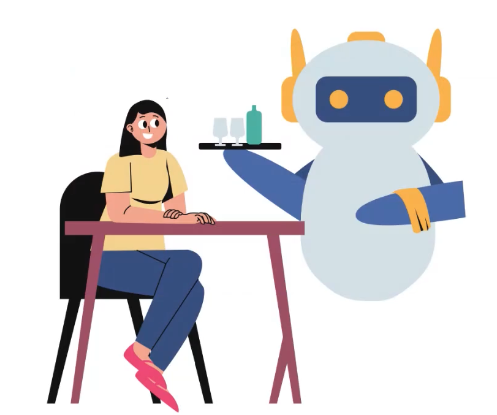
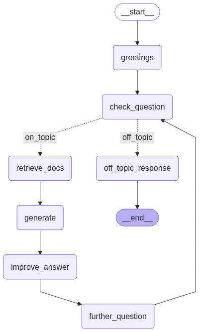

<p align="center">
  
</p>


# 🤖 Agentic RAG: Building an Intelligent Restaurant Server

This report provides a deep dive into the "Agentic RAG" project, an intelligent agent designed to simulate a friendly and helpful restaurant server. The project leverages a powerful combination of **Retrieval-Augmented Generation (RAG)** and **AI agent methodologies** to create a dynamic, context-aware, and interactive conversational experience.

## 📜 Project Overview

The primary goal of this project is to build an intelligent agent that can:

*   👋 **Interact with customers** in a natural and friendly manner.
*   ❓ **Answer questions** about the restaurant's menu.
*   😊 **Provide helpful and professional responses**, adapting to the flow of the conversation.

The implementation, detailed in the `Agentic_RAG.ipynb` notebook, uses **LangChain** and **LangGraph** to orchestrate the agent's workflow, integrated with **OpenAI's GPT models** for language understanding and generation.

## 🧠 Key Concepts: From RAG to Agentic RAG

This project represents a significant evolution from traditional RAG systems.

*   **Traditional RAG**: A static, one-shot process. The system takes a user query, retrieves relevant documents, and generates a single response. It lacks memory and decision-making capabilities.
*   **Agentic RAG**: A dynamic, multi-step process. An AI agent controls the entire workflow, making decisions at each step. It decides *whether* to retrieve information, *how* to generate a response, *if* the response needs improvement, and *what* to do next.

Here's a comparison highlighting the key differences:

| Feature | Traditional RAG | Agentic RAG (This Project) |
| :--- | :--- | :--- |
| **Workflow** | 🧊 Static & Linear | 🌊 Dynamic & Cyclical |
| **Control** | 🤖 System-driven | 🧠 Agent-driven |
| **Context** | ❌ Stateless | ✅ State-aware (remembers history) |
| **Decision-Making** | 🚫 None | ✅ Topic checking, response refinement |
| **Interaction** | 🗣️ Single turn | 💬 Multi-turn conversation |

## 🛠️ Tech Stack & Core Components

The agent is built upon a modern stack of libraries and models designed for creating sophisticated AI applications.

*   **Orchestration & Workflow**:
    *   `LangChain`: Used for chaining components like prompts, models, and retrievers.
    *   `LangGraph`: The core of the agentic behavior, used to define the conversational flow as a state machine or graph.
*   **Language Models & Embeddings**:
    *   `ChatOpenAI (gpt-4o-mini)`: The model used for all decision-making, generation, and refinement tasks.
    *   `OpenAIEmbeddings`: Used to convert menu data into vector embeddings for semantic search.
*   **Data Processing & Retrieval**:
    *   `UnstructuredExcelLoader`: For loading and parsing the menu data from a `.xlsx` file.
    *   `FAISS (Facebook AI Similarity Search)`: An efficient vector store for performing similarity searches on the menu embeddings.
*   **State Management**:
    *   `TypedDict`: A Python class used to define a structured state object (`AgentState`) that persists across the conversation.

## ⚙️ System Architecture & Workflow

The agent's logic is defined as a graph using `LangGraph`. Each node in the graph is a function that performs a specific task, and the edges define the flow of control.

### Workflow Diagram

The following diagram, generated from the `LangGraph` implementation, visualizes the agent's decision-making process:

<p align="center">
  
</p>


### Step-by-Step Breakdown

1.  **`greetings` (Start)**: The conversation begins. The agent greets the user and captures their first question.
2.  **`check_question` (Decision Node)**: The agent uses an LLM to determine if the user's question is on-topic (related to the restaurant/menu). This is the first critical decision point.
    *   **Prompt Engineering**: A system prompt instructs the LLM to act as a "grader" and return only "True" or "False".
3.  **`topic_router` (Conditional Edge)**: Based on the output of `check_question`, the graph routes the conversation:
    *   If **On-Topic ("True")**: The flow proceeds to `retrieve_docs`.
    *   If **Off-Topic ("False")**: The flow moves to `off_topic_response`.
4.  **`retrieve_docs` (Retrieval)**: The user's question and conversation history are used to perform a similarity search in the `FAISS` vector store, retrieving the top 5 most relevant menu items.
5.  **`generate` (Generation)**: The retrieved documents, conversation history, and the user's question are fed into an LLM with a "server" persona to generate an initial answer.
6.  **`improve_answer` (Refinement)**: In a key "agentic" step, another LLM call is made to review and refine the generated answer. This ensures the response is polite, professional, and includes an open-ended question to encourage further interaction.
7.  **`further_question` (Loop)**: The agent prompts the user for another question, captures the input, and routes the flow back to `check_question` to continue the cycle.
8.  **`off_topic_response` (Handling Logic)**: If a question is off-topic, the agent provides a graceful response. The logic smartly differentiates:
    *   **First Turn**: Politely sets boundaries ("I can only answer questions about the menu...").
    *   **Subsequent Turns**: Gives a neutral, brief response ("Happy to help.") to avoid repetition and subtly steer the conversation back.
9.  **`END`**: The `off_topic_response` node connects to the end of the workflow, terminating that branch of the conversation.

## 💻 Detailed Implementation Walkthrough

### 🗂️ State Management with `AgentState`

The entire conversation's context is managed within a `TypedDict` called `AgentState`. This is the single object passed between nodes in the `LangGraph`.

```python
# Define a TypedDict to store the agent's state
class AgentState(TypedDict):
    start: bool           # Indicates if the conversation has started
    conversation: int     # Keeps track of conversation turns
    question: str         # Customer's question
    answer: str           # Agent's answer
    topic: bool           # Decision on whether the question is appropriate
    documents: list       # Relevant documents retrieved
    recursion_limit: int  # To avoid endless loops
    memory: list          # Conversation history
```

### 🧠 The Agent's Brain: Key Functions

Each node in the graph is powered by a Python function. Here are the most critical ones:

#### `check_question()` - The Gatekeeper

This function uses a specifically crafted prompt to make a binary decision, forming the basis for conditional routing.

```python
# system_prompt for check_question
"""
You are a grader evaluating the appropriateness of a customer's
question to a server in a restaurant.
...
Respond with "True" if the question is appropriate...
Otherwise respond with "False".
Provide only "True" or "False" in your response.
"""
model = ChatOpenAI(model="gpt-4o-mini", api_key=api_key)
response_text = model.invoke(prompt)
state['topic'] = response_text.content.strip() # Stores "True" or "False"
```

#### `retrieve_docs()` - The Retriever

This function leverages the FAISS vector store to find relevant information from the menu, using the entire conversation history for better context.

```python
def retrieve_docs(state):
    # Combine the conversation history into a single string
    memory = ".join(state['memory'])
    
    # Retrieve the top 5 relevant documents
    docs_faiss = db.similarity_search(memory, k=5)
    
    # Store the retrieved documents' content in the state
    state['documents'] = [doc.page_content for doc in docs_faiss]
    return state
```

#### `improve_answer()` - The Refiner

This is a powerful agentic feature where the system critiques and improves its own output. The prompt guides the LLM to refine the tone, add politeness, and conclude with an engaging follow-up question.

```python
# system_prompt for improve_answer
"""
As a server, review and refine the response to a customer's question. Your task is to:
1. Ensure the answer is appropriate, friendly, and informative.
...
5. Conclude the response with an open-ended question to invite further inquiries...
...
Deliver a refined response that enhances the customer's experience...
"""
```

## 💬 Conversation Example

The notebook demonstrates a full conversation, showcasing the agent's capabilities in action.

> **User**: I want some chicken and rice. Do you have something like that?
>
> **Agent**: We have a delicious option for you! You can enjoy our **Arroz em Lótus**, which features sticky rice with chicken, shrimp, and mushrooms. If you prefer just rice, we also offer **Arroz ao vapor** (Steamed Rice) that can accompany our chicken dishes. Would you like to try one of these, or do you have something else in mind?
>
> **User**: Yes I want one of these please. And what about dessert items?
>
> **Agent**: We have a lovely selection of desserts! You might enjoy our **Crepe Banana e Chocolate**... If you're looking for something smaller, we offer **Mochis**... Would you like to add a dessert to your order, or do you have any other questions?
>
> **User**: One Peanut Mochi please. No all good. Thanks
>
> **Agent**: Happy to help. 😊

## 🚀 Future Enhancements & Next Steps

This project provides a solid foundation. Based on the recap analysis, here are potential areas for future development:

*   **🔗 Long-Term Memory**: Implement a mechanism (e.g., a database) to store user preferences across sessions. A returning customer who mentioned a nut allergy would not be recommended peanut mochi.
*   **🎭 Improved Context Awareness**:
    *   **Sentiment Analysis**: Adapt the agent's tone based on the user's perceived sentiment (e.g., more apologetic if the user seems frustrated).
    *   **Semantic Understanding**: Break down complex, multi-part questions (e.g., "What's a good chicken dish that's not too spicy and what wine pairs well with it?").
*   **🎤 Multimodal Capabilities**: Extend the agent to accept **voice input** and respond with synthesized speech, creating a true "digital server" experience.
*   **🌐 Expanded Knowledge Base**: Allow the agent to access external APIs to answer questions beyond the menu, such as providing details on wine pairings from an external database or checking real-time ingredient availability.

## ✨ Conclusion

This Agentic RAG project successfully demonstrates the power of combining autonomous AI agents with retrieval systems. By using **LangGraph** to create a stateful, cyclical workflow, the agent moves beyond simple Q&A to manage a coherent, helpful, and human-like conversation. Its ability to check for relevance, refine its own answers, and gracefully handle off-topic queries makes it a robust and sophisticated example of next-generation conversational AI.