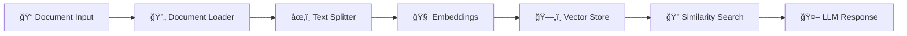
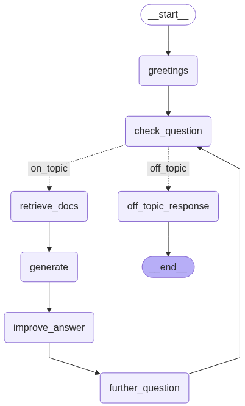

# RAG (Retrieval Augmented Generation) for LLMs

<p align="center">
  
</p>


Retrieval Augmented Generation (RAG) is a cutting-edge approach that combines the power of large language models (LLMs) with external knowledge sources to deliver more accurate, up-to-date, and contextually relevant responses. This repository showcases a variety of RAG projects and techniques, ranging from document and menu automation to advanced agentic and multimodal systems.

Whether you're looking to automate data extraction, build intelligent chatbots, or explore the latest in AI-powered retrieval, this collection provides practical, end-to-end examples and best practices for building robust RAG pipelines.


# Table of Contents

1. [ğŸ½ï¸ Restaurant Menu Automation Project: From Images to Excel with GenAI ✨](#ï¸-restaurant-menu-automation-project-from-images-to-excel-with-genai-ï¸)
2. [🧠 Smart Cookbook RAG System & Agentic RAG ğŸ³ğŸ“š](#-smart-cookbook-rag-system--agentic-rag-)
3. [🚀 RAG Unstructured Data Handling with LangChain](#-rag-unstructured-data-handling-with-langchain)
4. [🚀 **Project Overview: Multimodal RAG**](#-project-overview-multimodal-rag)
5. [🚀 Project Analysis: Multimodal RAG for Starbucks Financials](#-project-analysis-multimodal-rag-for-starbucks-financials)
6. [🤖 Project Analysis: RAG with OpenAI's Native File Search](#-project-analysis-rag-with-openais-native-file-search)
7. [🤖 Agentic RAG: Building an Intelligent Restaurant Server](#-agentic-rag-building-an-intelligent-restaurant-server)
8. [🚀 Project Overview: Building Knowledge Graphs with LightRAG](#-project-overview-building-knowledge-graphs-with-lightrag)
9. [🯠Introduction: The "Why" Behind RAGAS](#-introduction-the-why-behind-ragas)

---

# ğŸ½ï¸ Restaurant Menu Automation Project: From Images to Excel with GenAI ✨

This project offers an innovative solution to automate the conversion of restaurant menus from images or PDFs into structured Excel files, significantly reducing the need for manual data entry. This free service is designed to help restaurants quickly generate upload-ready spreadsheets, thereby saving time and costs. The primary goal is to transform unstructured menu data into a clean, consistent, and usable tabular format for further analysis or integration.

## 🚀 Project Overview & Key Objectives

The inspiration for this project came from the real-world challenge faced by a startup where menu items had to be added one by one, including translations, which was highly inefficient, especially for menus with hundreds of items. Leveraging vision models and Generative AI (GenAI), this solution automates that process.

**Key Objectives:**
*   **Automate Data Entry:** Eliminate the manual and time-consuming process of entering menu items and their details.
*   **Cost Savings:** Provide a free service that helps restaurants save money they might otherwise spend on digital menu services (e.g., €480 per year).
*   **Structured Output:** Convert diverse menu formats (PDFs, images) into a standardized Excel spreadsheet that adheres to a strict template.
*   **Scalability:** Develop a process that can efficiently handle multiple PDFs and images to generate a comprehensive menu Excel file.

## 💡 The Workflow: PDF → Image → Excel

The entire process is broken down into two main stages, each handled by a dedicated Jupyter Notebook:

1.  **PDF to Images Conversion** (using `PDF to Images.ipynb`) â¡ï¸ Converts PDF menus into individual image files.
2.  **Image to Excel Conversion with GenAI** (using `Image to Excel GenAI.ipynb`) â¡ï¸ Processes these images (or any other menu images) and extracts structured data into an Excel spreadsheet.

This streamlined workflow allows for the creation of an upload-ready Excel file in less than 5 minutes.

## 📂 Step 1: `PDF to Images.ipynb` 📸

This notebook is responsible for converting PDF menu files into image formats (JPG). This is a crucial preliminary step when the initial menu source is a PDF, as the subsequent GenAI model primarily works with images.

**How it works:**
*   The notebook utilizes libraries like `fitz` (PyMuPDF) and `PIL` (Pillow) to handle PDF and image processing.
*   It identifies all `.pdf` files within a specified source directory.
*   For each PDF document, it iterates through its pages.
*   Each page is converted into a pixmap and then saved as a separate JPG image file.
*   Existing contents in the target directory are removed before saving new images to ensure a clean conversion.
*   The output images are stored in a designated `pdf_to_image` directory.

## 📊 Step 2: `Image to Excel GenAI.ipynb` 🤖

This is the core of the project, where **Generative AI** is used to analyze menu images and convert their content into a structured Excel format.

**Key Components & Workflow:**

1.  **AI Model & System Prompt:**
    *   The project uses the **`gpt-4o`** model from OpenAI for its analysis and conversion capabilities.
    *   A **detailed system prompt** instructs the `gpt-4o` model on how to interpret the menu images and convert them into the required structured Excel format. This prompt ensures data consistency and adherence to a specific template.

2.  **Excel Template Structure (Columns Guide):**
    The output Excel spreadsheet follows a precise structure, with each row representing a unique menu item. Category and subcategory names are repeated for items within the same subcategory, and certain columns are left blank if not applicable.
    The strict column definitions ensure database integrity and proper data representation

3.  **Core Workflow Phases:**
    The process of extracting structured data from a set of menu images involves these phases:

    *   **Phase 1: Image Retrieval & Encoding** 🖼ï¸
        *   For each image file (PNG, JPG, JPEG) in the specified directory, the image is loaded.
        *   The image is then encoded into **base64 format** for transmission to the AI model.

    *   **Phase 2: GenAI Model Analysis** 🧠
        *   The encoded image is sent to the `gpt-4o` model.
        *   A user prompt instructs the model to "Convert this menu image to a structured Excel Sheet Format".

    *   **Phase 3: Data Extraction & Aggregation** 📥
        *   The model's response, typically formatted as a markdown table, is parsed row by row.
        *   Each valid row of extracted data is then appended to a **Pandas DataFrame**. This DataFrame gradually builds a comprehensive structured dataset from all processed images.

4.  **Output:**
    *   The final Pandas DataFrame, containing all the extracted and structured menu data, is then saved as an **Excel file (`.xlsx`)**.
    *   The user is prompted to enter a desired filename for the Excel output.

This automated process ensures that restaurant menus, whether from PDFs or images, are quickly and accurately transformed into a usable, structured format, ready for any digital menu system or further analysis.
# 🧠 Smart Cookbook RAG System & Agentic RAG ğŸ³ğŸ“š

Welcome to the **Smart Cookbook RAG System** – a fun, technical, and tasty project that brings together the power of **OpenAI**, **RAG (Retrieval Augmented Generation)**, and **Agentic AI** to transform dusty old cookbooks into dynamic digital culinary assistants! 🤖✨

---

## 🯠Project Purpose: From Old Recipes to Smart Agents

Have you ever struggled to find the right recipe in a traditional cookbook? This project tackles exactly that using **cutting-edge AI**.

We build:
- 🧾 A system to extract recipe content from scanned cookbooks.
- ğŸ—ï¸ Structured data suitable for embedding and RAG.
- 🤖 Agentic features to make the system *think* and *act*, not just respond.

---

## 📘 Phase 1: Smart Cookbook RAG 🧑â€ğŸ³

### 🔠Problem: Cookbooks are Unstructured

📚 Old cookbooks contain loads of valuable recipes, but:
- ⌠No easy search
- 🤷 No contextual filtering
- 🧩 No consistent structure

---

### âš™ï¸ Solution Architecture

1. 📄 **PDF Input** – Original cookbooks scanned into PDF.
2. ğŸ–¼ï¸ **Image Conversion** – PDF pages are turned into JPEGs via `pdf2image`.
3. 🧠 **Text Extraction** – Images sent to **OpenAI GPT-4o** for OCR and content understanding.
4. 🧾 **Structured Formatting** – Extracted data turned into:
   - `title`, `ingredients`, `instructions`, `cuisine`, `dish type`, `tags`
5. 🔠**Embeddings & RAG Integration** – Processed into vector databases for contextual querying.

> ✅ Example output includes recipes like:
> **Boston Brown Bread**, **Doughnuts**, **Popovers**, **Baked Mackerel**, and more!

---

## ğŸ½ï¸ Features

- 🧠 **Multi-recipe extraction** across 130+ pages!
- 🔗 **RAG embedding-ready format**
- 📌 Auto-categorization into metadata for tags, cuisine, dish type
- âš¡ Uses **deterministic model prompts** (temperature = 0) for consistent outputs

---

## 🧠 Phase 2: Agentic RAG – Smarter Than Ever 🤖💡

### What is Agentic RAG?

🚀 Taking RAG a step further:
- Instead of just *retrieving* and *responding*...
- Agentic RAG *acts* 🕹ï¸, *decides* 🧠, and *helps* proactively ğŸ¤

---

### ✨ Agentic Abilities

- 🛒 Auto-generate shopping lists
- 📅 Add events to calendars ("Bake cake at 5 PM")
- 🧾 Verify if you have ingredients in your pantry
- 🤠Work alongside other agents (e.g., fact-checkers, formatters)

---

### 🔄 Continuous Improvement

- 🔠**Feedback loops** enhance relevance and output
- 📦 **Multi-modal input** (text + image) enables richer interactions
- 🧱 Foundation for future features like:
  - 📸 Visual recipe recognition
  - 📹 Step-by-step video assistants

---

## 🧪 Libraries & Tools

* `openai` – Chat completion + vision APIs
* `pdf2image` – PDF to image conversion
* `base64` – Image encoding
* `dotenv` – Secure API key loading
* `pandas` – Organizing recipe data
* `IPython.display` – Pretty result visualization

---

## 🌠Applications Beyond Cooking

This system is not just about food ğŸ². The same techniques can be applied to:

* 📑 Legal documents
* 🧪 Scientific papers
* ğŸ—£ï¸ Customer reviews
* ğŸ›ï¸ Historical archives

---

## 📸 Sample Output

```markdown
### 🥖 Recipe Title: Bannocks

**Ingredients**:
- 1 Cupful of Thick Sour Milk
- ½ Cupful of Sugar
- 2 Cupfuls of Flour
- ½ Cupful of Indian Meal
- 1 Teaspoonful of Soda
- A pinch of Salt

**Instructions**:
1. Drop mixture into boiling fat.
2. Serve warm with maple syrup.

**Tags**: 🥠Breakfast | 🧂 Traditional | ğŸ Sweet
```

---

## 🔠Setup Instructions

1. Clone this repo
2. Place your `.env` file with `OPENAI_API_KEY`
3. Run the notebook to extract & structure recipes

---

## 🙠Acknowledgements

This project draws inspiration from the broader work on RAG, Agentic AI, and LangGraph.

Special thanks to:

* 🧑â€ğŸ« The cooking community for timeless recipes
* 🧠 OpenAI for GPT-4o mini
* 📖 Heritage cookbooks for data

---

## 💡 Future Work

* 📦 Export to JSON/CSV for search integration
* 🧑â€ğŸ³ Web app with visual meal planner
* 🔠Query recipes by taste, diet, mood, etc.
* 📲 Voice command integration

---

## 🥂 Final Thoughts

By merging the timeless joy of cooking with modern AI, this project not only revives old knowledge but also reimagines how we interact with unstructured data. 🧑â€ğŸ³ğŸ“ˆ

**Enjoy cooking — the smart way!**

---

# 🚀 RAG Unstructured Data Handling with LangChain

[](https://www.python.org/downloads/)
[](https://langchain.com/)
[](https://openai.com/)
[](LICENSE)

## 📖 Overview

Transform your messy, unstructured data into an intelligent, searchable knowledge base! This project demonstrates how to build powerful **Retrieval Augmented Generation (RAG) systems** using LangChain to process various document formats and extract meaningful insights.

### 🯠What This Project Solves

- **📚 Document Chaos**: Turn scattered files into organized, searchable knowledge
- **🔠Information Retrieval**: Find exact answers from vast document collections
- **💡 Intelligent Analysis**: Generate contextual responses from unstructured data
- **âš¡ Automation**: Replace manual document searching with AI-powered retrieval

## ğŸ› ï¸ Supported Document Types

| Format                 | Icon | Use Cases                           | Chunk Size Recommendation |
| ---------------------- | ---- | ----------------------------------- | ------------------------- |
| **Excel (.xlsx)**      | 📊   | Reviews, datasets, structured data  | 2000 chars                |
| **Word (.docx)**       | 📄   | Reports, articles, documentation    | 500 chars                 |
| **PowerPoint (.pptx)** | 📋   | Presentations, pitch decks          | 200-300 chars             |
| **EPUB (.epub)**       | 📖   | Ebooks, digital publications        | 300-400 chars             |
| **PDF (.pdf)**         | 📑   | Academic papers, contracts, manuals | 500-2200 chars            |

## ğŸ—ï¸ Architecture



## âš™ï¸ Core Workflow

### 1. 📥 Document Loading

```python
# Load documents with appropriate loaders
loader = UnstructuredExcelLoader("data.xlsx", mode="elements")
docs = loader.load()
```

### 2. âœ‚ï¸ Text Chunking

```python
text_splitter = RecursiveCharacterTextSplitter(
    chunk_size=2000,    # Adjust based on document type
    chunk_overlap=200   # Maintain context between chunks
)
chunks = text_splitter.split_documents(docs)
```

### 3. 🧠 Embeddings Generation

```python
embeddings = OpenAIEmbeddings(
    model="text-embedding-3-large"  # High performance model
)
```

### 4. ğŸ—„ï¸ Vector Storage

```python
db_faiss = FAISS.from_documents(chunks, embeddings)
```

### 5. 🔠Query & Retrieval

```python
docs_faiss = db_faiss.similarity_search_with_score(query, k=5)
```

## 🚀 Quick Start

### Prerequisites

```bash
pip install langchain-community
pip install langchain-openai
pip install faiss-cpu
pip install python-docx
pip install python-pptx
pip install pypandoc
pip install pymupdf
pip install unstructured[all-docs]
```

### Environment Setup

```python
from dotenv import load_dotenv
import os

load_dotenv()
api_key = os.getenv('OPENAI_API_KEY')
```

### Basic Usage Example

```python
from langchain_community.document_loaders import UnstructuredExcelLoader
from langchain.text_splitter import RecursiveCharacterTextSplitter
from langchain_openai import ChatOpenAI, OpenAIEmbeddings
from langchain.vectorstores.faiss import FAISS

def process_document(file_path, chunk_size=2000):
    # Load document
    loader = UnstructuredExcelLoader(file_path, mode="elements")
    docs = loader.load()

    # Split into chunks
    text_splitter = RecursiveCharacterTextSplitter(
        chunk_size=chunk_size,
        chunk_overlap=200
    )
    chunks = text_splitter.split_documents(docs)

    # Create embeddings and vector store
    embeddings = OpenAIEmbeddings(model="text-embedding-3-large")
    db_faiss = FAISS.from_documents(chunks, embeddings)

    return db_faiss

def ask_question(db, query, k=5):
    # Retrieve relevant documents
    docs = db.similarity_search_with_score(query, k=k)

    # Prepare context
    context = "\n\n".join([doc.page_content for doc, _score in docs])

    # Generate response
    model = ChatOpenAI(model="gpt-4o-mini", temperature=0)
    prompt = f"""
    Based on this context: {context}
    Please answer this question: {query}
    If you don't know the answer, say you don't know.
    """

    response = model.invoke(prompt)
    return response.content
```

## 📋 Document-Specific Configurations

### 📊 Excel Files

- **Chunk Size**: 2000 characters
- **Best For**: Reviews, structured data, surveys
- **Mode**: `elements` (breaks into manageable parts)

### 📄 Word Documents

- **Chunk Size**: 500 characters
- **Best For**: Reports, articles, lengthy documents
- **Special Requirements**: NLTK punkt tokenizer

### 📋 PowerPoint Presentations

- **Chunk Size**: 200-300 characters
- **Best For**: Pitch decks, educational content
- **Advantage**: Extracts text boxes and slide components

### 📖 EPUB Files

- **Chunk Size**: 300-400 characters
- **Best For**: Ebooks, digital publications
- **Considerations**: Contains metadata and images

### 📑 PDF Files

- **Chunk Size**: 500-2200 characters (varies by content)
- **Best For**: Academic papers, contracts, manuals
- **Special Cases**: OCR needed for scanned PDFs

## ğŸ›ï¸ Parameter Tuning Guide

### Chunk Size Optimization

- **Small chunks (200-500)**: Better for specific information retrieval
- **Large chunks (1000-2000)**: Better for maintaining context
- **Consider document type**: PowerPoint needs smaller chunks than PDFs

### Chunk Overlap Guidelines

- **Standard**: 10-20% of chunk size
- **Narrative content**: Higher overlap (20-25%)
- **Structured data**: Lower overlap (5-10%)

## 💡 Best Practices

### 🔧 Technical Considerations

- **API Key Security**: Always use environment variables
- **Cost Optimization**: Consider smaller embedding models for development
- **Performance**: Batch process large document collections
- **Memory Management**: Use appropriate chunk sizes to avoid token limits

### 📊 Quality Improvements

- **Preprocessing**: Clean documents before processing
- **Metadata Extraction**: Store document metadata separately for EPUB files
- **OCR Integration**: Use Tesseract for scanned PDFs
- **Multicolumn Handling**: Linearize text flow for academic papers

## 🔠Example Queries

```python
# Load and process a document
db = process_document("reviews.xlsx")

# Ask specific questions
response = ask_question(db, "What are the worst reviews?")
print(response)

response = ask_question(db, "Analyze the feedback for improvements")
print(response)
```

## 📈 Performance Optimization

### Vector Store Options

- **FAISS**: Fast similarity search (used in examples)
- **Chroma**: Alternative with persistence
- **Pinecone**: Cloud-based solution for production

### Embedding Models

- **text-embedding-3-large**: Best performance (most expensive)
- **text-embedding-3-small**: Faster, cheaper alternative
- **Custom embeddings**: Cost-effective for specific domains

## 🚨 Troubleshooting

### Common Issues

- **Token Limits**: Reduce chunk size or overlap
- **Poor Retrieval**: Increase chunk overlap or adjust similarity threshold
- **Slow Processing**: Use smaller embedding models or batch processing
- **OCR Errors**: Preprocess scanned PDFs with better OCR tools

### Document-Specific Issues

- **Excel**: Use `table` mode for well-structured data
- **PowerPoint**: Increase chunk size for detailed slides
- **PDF**: Handle multicolumn layouts with preprocessing
- **EPUB**: Extract metadata separately for better indexing

---

**✨ Transform your documents into intelligent, searchable knowledge bases with RAG and LangChain!**
<p align="center">
  
</p>


# 🚀 **Project Overview: Multimodal RAG**

This project masterfully demonstrates how to build a Multimodal RAG system from scratch. The goal is to take a video file (`decision-making-course.mp4`), process its audio and visual components, and create a system that can answer questions about its content by retrieving relevant text and images to feed into a generative AI model.

The entire pipeline can be broken down into three main phases:

1.  **Data Preprocessing**: Extracting text (from audio) and images (from video frames).
2.  **Retrieval**: Embedding the multimodal data and finding the most relevant pieces of information based on a user query.
3.  **Generation**: Using a multimodal LLM to synthesize an answer from the retrieved context.

Let's dive into the technical details of each step!

### **Step 1 & 2: Environment Setup & Data Loading âš™ï¸**

This is the foundational setup phase within a Google Colab environment.

- **Google Drive Integration**: The notebook starts by mounting Google Drive to access the project files. This is standard practice for managing data and notebooks in Colab.
- **File Organization**: The project directory (`/content/drive/MyDrive/ztm/rag_ztm/multimodal_rag/`) contains the source video (`decision-making-course.mp4`) and subdirectories for storing processed data (`audios`, `frames`, `transcripts`).

### **Step 3: Audio Extraction & Compression 🔊**

The first step in processing the video is to isolate the audio track.

- **Audio Extraction**: The powerful command-line tool **`ffmpeg`** is used to extract the audio from the `.mp4` video file and save it as an `.mp3`. The command `subprocess.run(['ffmpeg', '-i', video_path, ...])` automates this process directly from Python.
- **Compression**: The extracted audio is then compressed to a **32k bitrate**. This is a clever optimization to reduce file size, which speeds up subsequent processing steps like transcription, without a significant loss in speech clarity.

### **Step 4: Transcription with OpenAI Whisper âœï¸**

With the audio prepared, the next step is to convert speech to text.

- **Whisper Model**: The notebook leverages OpenAI's **Whisper model** (`whisper-1`) for highly accurate audio transcription. This is a cornerstone of the project, as the quality of the transcribed text directly impacts the entire RAG system's performance.
- **API Call**: The `client.audio.transcriptions.create()` method is used to send the compressed audio file to the OpenAI API and receive the full text transcript.
- **Saving the Transcript**: The resulting text is saved to `transcripts/transcript.txt` for persistence and later use.

### **Step 5: Video Frame Extraction 🖼ï¸**

To capture the visual modality, the notebook samples frames from the video.

- **`moviepy` Library**: The `moviepy` library is used to handle video processing. It loads the video file using `VideoFileClip`.
- **Frame Sampling**: Frames are extracted at a fixed `interval` of **10 seconds**. This is a pragmatic approach to capture representative visual moments without creating an overwhelming number of images. Each frame is saved as a `.png` file (e.g., `frame_0000.png`, `frame_0010.png`).

### **Step 6 & 7: Multimodal Embedding with CLIP 🧠**

This is the core of the multimodal alignment. The project uses the **CLIP (Contrastive Language-Image Pre-training)** model (`openai/clip-vit-base-patch32`) to convert both text and images into a shared embedding space.

- **Text Embedding**:

  - **The Challenge**: The full transcript is too long (9901 tokens) for CLIP's fixed context window (77 tokens).
  - **The Solution**: The text is broken down into **129 smaller chunks**, each with a maximum of 77 tokens. This chunking strategy is a crucial workaround.
  - Each text chunk is then individually embedded using `model.get_text_features`, resulting in a text embedding matrix of shape **`(129, 512)`**.

- **Image Embedding**:
  - Each of the **373 extracted frames** is processed using the CLIP image processor.
  - The processed images are passed through `model.get_image_features` to generate embeddings.
  - This results in an image embedding matrix of shape **`(373, 512)`**.

At this point, both the textual concepts and visual scenes from the video are represented as 512-dimensional vectors in the same semantic space.

### **Step 8: Alignment via Cosine Similarity ğŸ“**

While the notebook calls this step "Contrastive Learning," it's more accurately the _application_ of a model trained with contrastive learning. This step aligns the text and image embeddings.

- **Similarity Matrix**: **Cosine Similarity** is calculated between every text embedding and every image embedding. This produces a similarity matrix of shape **`(129, 373)`**, where each cell `(i, j)` represents how well text chunk `i` matches image `j`.
- **Validation**: The notebook cleverly validates this alignment by picking random text chunks and displaying the top 3 most similar images. The results on page 9 clearly show that the model successfully matches textual concepts (e.g., "cognitive biases," "system 2 thinking") with their corresponding diagrams and illustrations from the video.

### **Step 9: The Retrieval System (RAG) ğŸ”**

This is where the "Retrieval" in RAG comes to life. The system retrieves relevant context based on a user's question.

1.  **Query Embedding**: The user's query (e.g., `"Which cognitive biases are discussed?"`) is embedded using the same CLIP text encoder.
2.  **Text Retrieval**: The query embedding is compared against all **129 text chunk embeddings** using cosine similarity. The indices of the top 10 most relevant text chunks are retrieved.
3.  **Image Retrieval**: For each of the top 10 text chunks, the system refers back to the main similarity matrix to find the **top 2 most similar images**.
4.  **Context Aggregation**: The retrieved image indices are collected and deduplicated, resulting in a final set of **14 unique images** that are most relevant to the user's query.

### **Step 10: The Generation System (RAG) ğŸ“**

Finally, the retrieved multimodal context is passed to a powerful generative model to synthesize an answer.

- **Context Preparation**:
  - The **10 retrieved text chunks** are joined together to form a coherent text block.
  - The **14 retrieved images** are opened, read as binary files, and encoded into **base64** strings. This is the standard format for passing images to multimodal LLM APIs.
- **Prompt Engineering**: A prompt is constructed for the `gpt-4o-mini` model. It consists of:
  - A **system prompt** instructing the AI to act as an "expert teacher."
  - The **retrieved images**, passed as a list of base64 data URLs.
  - The **retrieved text**, passed as a single text block.
- **Final Generation**: The model receives this rich, multimodal context and generates a comprehensive summary that directly answers the user's query, mentioning concepts like confirmation bias, anchoring bias, and System 1/2 thinking, all of which were present in the retrieved context.

### **💡 Conclusion & Key Takeaways**

This project is an excellent, end-to-end implementation of a Multimodal RAG system.

- **Smart Architecture**: The pipeline logically moves from data extraction and preprocessing to a sophisticated two-step retrieval process (query -> text -> images), and finally to generation.
- **Leveraging SOTA Models**: It effectively uses best-in-class models for each task: **`ffmpeg`** for media processing, **Whisper** for transcription, **CLIP** for multimodal embedding, and **`gpt-4o-mini`** for generation.
- **Practical Problem-Solving**: The notebook addresses real-world challenges, such as handling long text for CLIP by implementing a chunking strategy.
- **Power of Multimodality**: The final answer is richer and more contextually grounded than a text-only RAG system because it synthesizes information from both what was said (transcripts) and what was shown (frames).
## 🚀 Project Analysis: Multimodal RAG for Starbucks Financials

This project implements a sophisticated **Retrieval-Augmented Generation (RAG)** system designed to answer complex financial questions about Starbucks. It uniquely processes and understands information from two different sources: **audio recordings** of earnings calls and **PDF documents** of financial releases.

### 🯠Project Overview

The primary goal is to build a conversational AI bot that acts as a financial analyst. Instead of manually sifting through hours of audio and dozens of pages of reports, a user can simply ask a question and get a concise, data-driven answer.

*   **Data Sources 📊:**
    *   **Audio ğŸ™ï¸:** An MP3 file of a Starbucks earnings call (`starbucks-q3.mp3`).
    *   **Documents 📄:** A PDF financial report (`3Q24-Earnings-Release.pdf`).
*   **Core Challenge 🧗:** Financial data is dense and spread across different formats. This system tackles that by creating a unified understanding of both text and visual information.
*   **Key Innovation ✨:** The system **independently retrieves relevant information from both the audio transcript and the document's pages (as images)** before synthesizing a final answer.

---

### âš™ï¸ Technical Workflow & Implementation

The project follows a logical, step-by-step process to build the RAG pipeline. Here’s a breakdown of the implementation seen in the notebook:

#### 1. Environment & Setup 🛠ï¸

The foundation is built using a powerful stack of Python libraries, setting the stage for the entire workflow.
*   **Core AI/ML:** `openai`, `langchain`, `torch`, `sentence-transformers`.
*   **Audio Processing:** `openai-whisper` for state-of-the-art speech-to-text.
*   **Data Handling:** `pdf2image`, `Pillow` (PIL), `pandas`.

The code smartly checks for a **GPU (`cuda`)** to accelerate the demanding tasks of transcription and embedding.

#### 2. Audio Processing: From Speech to Text ğŸ™ï¸â¡ï¸ğŸ“

The system first tackles the audio data from the earnings call.
*   **Transcription:** The `whisper` model, specifically the powerful `large-v3-turbo` variant, is used to convert the `starbucks-q3.mp3` audio file into a full text transcript.
*   **Chunking:** The resulting long transcript is too large to be processed at once. It's broken down into smaller, manageable **chunks of 250 characters**. This allows the model to find very specific, relevant snippets later on. In this case, the transcript was divided into **58 chunks**.

```python
# In [13] - Chunking the transcribed audio text
chunk_size = 250
audio_chunks = [text[i:i+chunk_size] for i in range(0, len(text), chunk_size)]
```

#### 3. PDF Processing: From Document to Images 📄â¡ï¸ğŸ–¼ï¸

The PDF report isn't treated as text. Instead, it's converted into a series of images, one for each page. This captures all the visual elements like tables, charts, and layout, which are often lost in simple text extraction.
*   **Conversion:** The `pdf2image` library converts the **17-page PDF** into **17 separate JPG images**.
*   **Rationale:** This approach allows the system to "see" the financial tables and charts just as a human would, enabling a richer understanding of the data.

#### 4. Multimodal Embedding with CLIP 🧠

This is the most critical step, where the magic of multimodal AI happens.
*   **The Model:** The `clip-ViT-B-32` model from the `sentence-transformers` library is used. CLIP is designed to understand both text and images in the same "thought space."
*   **Unified Vector Space:** Both the **text chunks** from the audio and the **page images** from the PDF are fed into the CLIP model. It converts each item into a 512-dimensional vector (an embedding).
*   **The Result:**
    *   `audio_embeddings`: Shape `(58, 512)` -> 58 text chunks, each represented by a 512-number vector.
    *   `image_embeddings`: Shape `(17, 512)` -> 17 page-images, each represented by a 512-number vector.

Now, a text query can be directly and mathematically compared to both other texts and images to find the best match.

#### 5. The Retrieval Engine: Finding the Best Clues ğŸ”

With the data embedded, the system can now retrieve information relevant to a user's query.
*   **Query Embedding:** The user's question (e.g., *"what are the short term risks for the company"*) is also embedded into a 512-dimensional vector using the same CLIP model.
*   **Dual Search:** The system performs two separate searches using **cosine similarity**:
    1.  **Audio Search:** The query vector is compared against all **58 audio chunk vectors**.
    2.  **Image Search:** The query vector is compared against all **17 image vectors**.
*   **Ranking:** The system identifies the top `k` most similar chunks and images. In the example, it retrieves the top 20 audio chunks and the top 5 images.

#### 6. Context Assembly for the LLM 📦

The top search results are collected to serve as the "context" or "evidence" for the final answer.
*   **Text Context:** The text from the top 5 most relevant audio chunks is joined together into a single block of text.
*   **Image Context:** The top 5 most relevant page images are loaded and encoded into **Base64 format**. This is a standard method for sending images to an AI model via an API.

#### 7. The Generative Step: Synthesizing the Answer 🤖

Finally, all the pieces are sent to a large language model (LLM) to generate a human-readable answer.
*   **Model:** `gpt-4o-mini` is used for its powerful reasoning and multimodal capabilities.
*   **Prompting:** A carefully crafted **system prompt** instructs the model to act as a "financial advisor expert" and, crucially, to base its answer **only on the provided context** (the text and images).
*   **Multimodal Input:** The model receives a complex message containing:
    1.  The role-defining system prompt.
    2.  The user's original query.
    3.  The concatenated text context from the audio.
    4.  The Base64-encoded images from the PDF.
*   **Final Output:** The LLM synthesizes all this information to produce a structured, detailed answer, as seen in the final output cell.

### 💡 Key Insights & Takeaways

*   **True Multimodality:** This is a fantastic example of a true multimodal RAG system. It doesn't just process text; it leverages visual data from PDFs, enabling a more comprehensive analysis.
*   **Independent Retrieval:** The strategy of searching audio and images separately and then combining the results is highly effective. It allows the system to draw evidence from the best source for any given query.
*   **Grounded Generation:** The use of a strong system prompt and providing explicit context (the retrieved chunks and images) ensures the model's response is **grounded in the source data**, minimizing the risk of hallucination.
*   **End-to-End Automation:** This project demonstrates a complete, automated pipeline from raw, unstructured data (audio/PDF) to a precise, structured answer, showcasing the immense practical value of modern AI techniques.
# 🤖 Project Analysis: RAG with OpenAI's Native File Search

This project demonstrates a streamlined and powerful approach to building a **Retrieval-Augmented Generation (RAG)** system by leveraging the **OpenAI Assistants API** and its integrated **File Search** capabilities. Instead of manually building each component of the RAG pipeline, this notebook showcases how to use OpenAI's managed services to achieve the same goal with significantly less code and complexity.

### 🯠Project Goal

The objective is to create a knowledgeable assistant that can answer questions based on a private knowledge base. This is achieved by:

1.  **Uploading custom documents** (a `.docx` and a `.pdf`) to OpenAI.
2.  Creating a **managed Vector Store** where OpenAI automatically processes and indexes these documents.
3.  Using the `file_search` tool to have an AI model **retrieve relevant information** and **synthesize accurate answers**.

The project uses documents related to a fictional company named "Bitte" to demonstrate the workflow.

---

### ğŸ› ï¸ Technical Workflow & Implementation

The notebook follows a clean, API-driven workflow that abstracts away the low-level complexities of RAG.

#### 1. Setup and Authentication ✅

The project begins with standard environment setup: loading the `OPENAI_API_KEY` and initializing the OpenAI client. This is the entry point for all subsequent interactions with the API.

```python
# In [4] - Initializing the client
client = OpenAI()
```

#### 2. Creating the Knowledge Component 🧠

This is the core of the data preparation phase. Instead of manual chunking and embedding, the entire process is offloaded to OpenAI.

*   **File Upload:** The local documents (`.docx` and `.pdf`) are uploaded directly to OpenAI's servers using `client.files.create`.
    *   A critical parameter is `purpose="assistants"`, which tells OpenAI that these files are intended to be used as a knowledge base for an Assistant.

*   **Vector Store Creation:** A `Vector Store` is created, which acts as a managed, server-side container for the document embeddings.
    *   OpenAI **automatically handles the parsing, chunking, and embedding** of the files added to this store. This is a massive simplification compared to manual RAG pipelines.

```python
# In [6] & [7] - Creating the store and adding files
vector_store = client.vector_stores.create(name="Bitte Vector Store")
client.vector_stores.files.create(
    vector_store_id=vector_store.id,
    file_id=file_id
)
```

#### 3. Executing the RAG Query âš¡

This is where the retrieval and generation happen in a single, elegant API call.
The `client.responses.create` method is used, but it's configured to work as a RAG system.

*   **The `tools` Parameter:** This is the key that unlocks the RAG functionality. By specifying `type: "file_search"`, we instruct the model to use the attached `vector_store_ids` to find relevant information before answering.
*   **The `include` Parameter:** Setting `include = ["file_search_call.results"]` is a fantastic feature for transparency. It forces the API to return the exact text chunks (the "context") that it retrieved from the vector store to formulate its answer.

```python
# In [8] - The core RAG API call
response = client.responses.create(
    model="gpt-4.1-mini",
    input="List the benefits of Bitte",
    tools=[{
        "type": "file_search",
        "vector_store_ids": [vector_store.id]
    }],
    include=["file_search_call.results"]
)
```

The system first performs a semantic search (`Out[9]: ['benefits of Bitte']`) to find relevant text (`Out[10]`) and then uses that context to generate a final, structured answer (`Out[11]`).

#### 4. 🨠Advanced Customization: Persona Control

The notebook brilliantly demonstrates how to control the tone and style of the generated response by using the `instructions` parameter.

*   **Standard Response:** The first query results in a professional, clear, and structured list of benefits.
*   **Custom Persona:** By adding `instructions = "Answer like a funny boss..."`, the same RAG system provides an answer with a completely different personality ("Alright team, gather 'round!"), while still being factually grounded in the retrieved context. This showcases the creative flexibility of the Assistants API.

---

### 💡 Key Insights & Takeaways

*   **Simplicity and Abstraction:** This approach drastically simplifies RAG implementation. The complexities of chunking strategies, embedding models, and vector database management are entirely handled by OpenAI.
*   **Managed Infrastructure:** There is no need to host or maintain your own vector database. This lowers the operational overhead and makes it easier to get started.
*   **Integrated and Efficient Workflow:** The entire process—from file upload to a final, context-aware answer—is managed within a single, cohesive ecosystem.
*   **Transparency and Debuggability:** The ability to inspect the retrieved context (`file_search_call.results`) is invaluable for understanding *why* the model gave a certain answer and for building trust in the system.
*   **High-Level vs. Low-Level RAG:** This project provides an excellent contrast to the first (Starbucks) project.
    *   **Manual RAG (Starbucks):** Offers granular control over every step (chunk size, embedding model, similarity metric). Best for custom needs and research.
    *   **Managed RAG (OpenAI File Search):** Offers speed and simplicity. Best for rapid development and production systems where ease of use is a priority.


<p align="center">
  
</p>


# 🤖 Agentic RAG: Building an Intelligent Restaurant Server

This report provides a deep dive into the "Agentic RAG" project, an intelligent agent designed to simulate a friendly and helpful restaurant server. The project leverages a powerful combination of **Retrieval-Augmented Generation (RAG)** and **AI agent methodologies** to create a dynamic, context-aware, and interactive conversational experience.

## 📜 Project Overview

The primary goal of this project is to build an intelligent agent that can:

*   👋 **Interact with customers** in a natural and friendly manner.
*   â“ **Answer questions** about the restaurant's menu.
*   😊 **Provide helpful and professional responses**, adapting to the flow of the conversation.

The implementation, detailed in the `Agentic_RAG.ipynb` notebook, uses **LangChain** and **LangGraph** to orchestrate the agent's workflow, integrated with **OpenAI's GPT models** for language understanding and generation.

## 🧠 Key Concepts: From RAG to Agentic RAG

This project represents a significant evolution from traditional RAG systems.

*   **Traditional RAG**: A static, one-shot process. The system takes a user query, retrieves relevant documents, and generates a single response. It lacks memory and decision-making capabilities.
*   **Agentic RAG**: A dynamic, multi-step process. An AI agent controls the entire workflow, making decisions at each step. It decides *whether* to retrieve information, *how* to generate a response, *if* the response needs improvement, and *what* to do next.

Here's a comparison highlighting the key differences:

| Feature | Traditional RAG | Agentic RAG (This Project) |
| :--- | :--- | :--- |
| **Workflow** | 🧊 Static & Linear | 🌊 Dynamic & Cyclical |
| **Control** | 🤖 System-driven | 🧠 Agent-driven |
| **Context** | ⌠Stateless | ✅ State-aware (remembers history) |
| **Decision-Making** | 🚫 None | ✅ Topic checking, response refinement |
| **Interaction** | ğŸ—£ï¸ Single turn | 💬 Multi-turn conversation |

## ğŸ› ï¸ Tech Stack & Core Components

The agent is built upon a modern stack of libraries and models designed for creating sophisticated AI applications.

*   **Orchestration & Workflow**:
    *   `LangChain`: Used for chaining components like prompts, models, and retrievers.
    *   `LangGraph`: The core of the agentic behavior, used to define the conversational flow as a state machine or graph.
*   **Language Models & Embeddings**:
    *   `ChatOpenAI (gpt-4o-mini)`: The model used for all decision-making, generation, and refinement tasks.
    *   `OpenAIEmbeddings`: Used to convert menu data into vector embeddings for semantic search.
*   **Data Processing & Retrieval**:
    *   `UnstructuredExcelLoader`: For loading and parsing the menu data from a `.xlsx` file.
    *   `FAISS (Facebook AI Similarity Search)`: An efficient vector store for performing similarity searches on the menu embeddings.
*   **State Management**:
    *   `TypedDict`: A Python class used to define a structured state object (`AgentState`) that persists across the conversation.

## âš™ï¸ System Architecture & Workflow

The agent's logic is defined as a graph using `LangGraph`. Each node in the graph is a function that performs a specific task, and the edges define the flow of control.

### Workflow Diagram

The following diagram, generated from the `LangGraph` implementation, visualizes the agent's decision-making process:

<p align="center">
  
</p>


### Step-by-Step Breakdown

1.  **`greetings` (Start)**: The conversation begins. The agent greets the user and captures their first question.
2.  **`check_question` (Decision Node)**: The agent uses an LLM to determine if the user's question is on-topic (related to the restaurant/menu). This is the first critical decision point.
    *   **Prompt Engineering**: A system prompt instructs the LLM to act as a "grader" and return only "True" or "False".
3.  **`topic_router` (Conditional Edge)**: Based on the output of `check_question`, the graph routes the conversation:
    *   If **On-Topic ("True")**: The flow proceeds to `retrieve_docs`.
    *   If **Off-Topic ("False")**: The flow moves to `off_topic_response`.
4.  **`retrieve_docs` (Retrieval)**: The user's question and conversation history are used to perform a similarity search in the `FAISS` vector store, retrieving the top 5 most relevant menu items.
5.  **`generate` (Generation)**: The retrieved documents, conversation history, and the user's question are fed into an LLM with a "server" persona to generate an initial answer.
6.  **`improve_answer` (Refinement)**: In a key "agentic" step, another LLM call is made to review and refine the generated answer. This ensures the response is polite, professional, and includes an open-ended question to encourage further interaction.
7.  **`further_question` (Loop)**: The agent prompts the user for another question, captures the input, and routes the flow back to `check_question` to continue the cycle.
8.  **`off_topic_response` (Handling Logic)**: If a question is off-topic, the agent provides a graceful response. The logic smartly differentiates:
    *   **First Turn**: Politely sets boundaries ("I can only answer questions about the menu...").
    *   **Subsequent Turns**: Gives a neutral, brief response ("Happy to help.") to avoid repetition and subtly steer the conversation back.
9.  **`END`**: The `off_topic_response` node connects to the end of the workflow, terminating that branch of the conversation.

## 💻 Detailed Implementation Walkthrough

### ğŸ—‚ï¸ State Management with `AgentState`

The entire conversation's context is managed within a `TypedDict` called `AgentState`. This is the single object passed between nodes in the `LangGraph`.

```python
# Define a TypedDict to store the agent's state
class AgentState(TypedDict):
    start: bool           # Indicates if the conversation has started
    conversation: int     # Keeps track of conversation turns
    question: str         # Customer's question
    answer: str           # Agent's answer
    topic: bool           # Decision on whether the question is appropriate
    documents: list       # Relevant documents retrieved
    recursion_limit: int  # To avoid endless loops
    memory: list          # Conversation history
```

### 🧠 The Agent's Brain: Key Functions

Each node in the graph is powered by a Python function. Here are the most critical ones:

#### `check_question()` - The Gatekeeper

This function uses a specifically crafted prompt to make a binary decision, forming the basis for conditional routing.

```python
# system_prompt for check_question
"""
You are a grader evaluating the appropriateness of a customer's
question to a server in a restaurant.
...
Respond with "True" if the question is appropriate...
Otherwise respond with "False".
Provide only "True" or "False" in your response.
"""
model = ChatOpenAI(model="gpt-4o-mini", api_key=api_key)
response_text = model.invoke(prompt)
state['topic'] = response_text.content.strip() # Stores "True" or "False"
```

#### `retrieve_docs()` - The Retriever

This function leverages the FAISS vector store to find relevant information from the menu, using the entire conversation history for better context.

```python
def retrieve_docs(state):
    # Combine the conversation history into a single string
    memory = ".join(state['memory'])
    
    # Retrieve the top 5 relevant documents
    docs_faiss = db.similarity_search(memory, k=5)
    
    # Store the retrieved documents' content in the state
    state['documents'] = [doc.page_content for doc in docs_faiss]
    return state
```

#### `improve_answer()` - The Refiner

This is a powerful agentic feature where the system critiques and improves its own output. The prompt guides the LLM to refine the tone, add politeness, and conclude with an engaging follow-up question.

```python
# system_prompt for improve_answer
"""
As a server, review and refine the response to a customer's question. Your task is to:
1. Ensure the answer is appropriate, friendly, and informative.
...
5. Conclude the response with an open-ended question to invite further inquiries...
...
Deliver a refined response that enhances the customer's experience...
"""
```

## 💬 Conversation Example

The notebook demonstrates a full conversation, showcasing the agent's capabilities in action.

> **User**: I want some chicken and rice. Do you have something like that?
>
> **Agent**: We have a delicious option for you! You can enjoy our **Arroz em Lótus**, which features sticky rice with chicken, shrimp, and mushrooms. If you prefer just rice, we also offer **Arroz ao vapor** (Steamed Rice) that can accompany our chicken dishes. Would you like to try one of these, or do you have something else in mind?
>
> **User**: Yes I want one of these please. And what about dessert items?
>
> **Agent**: We have a lovely selection of desserts! You might enjoy our **Crepe Banana e Chocolate**... If you're looking for something smaller, we offer **Mochis**... Would you like to add a dessert to your order, or do you have any other questions?
>
> **User**: One Peanut Mochi please. No all good. Thanks
>
> **Agent**: Happy to help. 😊

## 🚀 Future Enhancements & Next Steps

This project provides a solid foundation. Based on the recap analysis, here are potential areas for future development:

*   **🔗 Long-Term Memory**: Implement a mechanism (e.g., a database) to store user preferences across sessions. A returning customer who mentioned a nut allergy would not be recommended peanut mochi.
*   **🭠Improved Context Awareness**:
    *   **Sentiment Analysis**: Adapt the agent's tone based on the user's perceived sentiment (e.g., more apologetic if the user seems frustrated).
    *   **Semantic Understanding**: Break down complex, multi-part questions (e.g., "What's a good chicken dish that's not too spicy and what wine pairs well with it?").
*   **🤠Multimodal Capabilities**: Extend the agent to accept **voice input** and respond with synthesized speech, creating a true "digital server" experience.
*   **🌠Expanded Knowledge Base**: Allow the agent to access external APIs to answer questions beyond the menu, such as providing details on wine pairings from an external database or checking real-time ingredient availability.

## ✨ Conclusion

This Agentic RAG project successfully demonstrates the power of combining autonomous AI agents with retrieval systems. By using **LangGraph** to create a stateful, cyclical workflow, the agent moves beyond simple Q&A to manage a coherent, helpful, and human-like conversation. Its ability to check for relevance, refine its own answers, and gracefully handle off-topic queries makes it a robust and sophisticated example of next-generation conversational AI.
# 🚀 Project Overview: Building Knowledge Graphs with LightRAG

This project provides a comprehensive walkthrough of using the `LightRAG` library to automatically construct and query a Knowledge Graph (KG) from unstructured text. The notebook uses a document about Greek mythology (`Greek-gods-story.pdf`) as its source data. The entire process, from data ingestion to interactive graph visualization, is demonstrated, highlighting the power and simplicity of the `LightRAG` framework.

---

### 💡 Core Technology: LightRAG

`LightRAG` is presented as a lightweight, efficient Retrieval-Augmented Generation (RAG) framework. The key advantages highlighted are:

*   **âš¡ Simplicity & Speed:** Designed for easy setup and fast performance, making it ideal for rapid prototyping and deployment.
*   **💸 Cost-Effective:** Its lightweight nature helps reduce computational overhead and associated costs.
*   **🧩 Flexible Integrations:** It can easily connect with various data sources and Large Language Models (LLMs).
*   **🤖 Key Capability:** The notebook's core focus is on its ability to perform **Automated Knowledge Graph extraction**, identifying entities and their relationships from raw text to build a structured, queryable knowledge base.

---

### âš™ï¸ Workflow & Implementation Details

The notebook follows a clear, step-by-step implementation plan.

#### 1. Environment Setup & Dependencies 🛠ï¸

The initial setup involves preparing the Python environment.

*   **Dependencies:** Key libraries are installed using `pip`:
    *   `lightrag-hku==1.1.1`: The core framework.
    *   `PyPDF2`: For parsing and extracting text from PDF files.
    *   `networkx` & `pyvis`: Essential for graph manipulation and creating interactive visualizations.
    *   `python-dotenv` & `google-colab-userdata`: For securely managing API keys.
*   **API Key Management:** The OpenAI API key is fetched securely using `userdata.get()` and set as an environment variable, which is a security best practice.
    ```python
    # Set the OpenAI API key in the environment
    api_key = userdata.get('OPENAI_API_KEY')
    os.environ['OPENAI_API_KEY'] = api_key
    ```
*   **Asyncio Compatibility:** `nest_asyncio` is used to allow `asyncio` event loops to run within a Jupyter/Colab environment, which is necessary for `LightRAG`'s asynchronous operations.
    ```python
    import nest_asyncio
    nest_asyncio.apply()
    ```

#### 2. Data Preparation Pipeline 📄â¡ï¸ğŸ“

The workflow begins by converting the unstructured data source (a PDF) into a clean text format.

1.  **Load PDF:** The `Greek-gods-story.pdf` file is opened in binary-read mode (`"rb"`).
2.  **Extract Text:** `PyPDF2.PdfReader` iterates through each page of the PDF, and `page.extract_text()` pulls the raw text content.
3.  **Save as TXT:** The extracted text lines are written to a new file, `greek_gods.txt`. This provides a standardized, clean input for the `LightRAG` system.

#### 3. Automated Knowledge Graph Construction 🧠

This is the central and most impressive step, where `LightRAG` automatically builds the knowledge base from the text.

*   **Initialization:** A `LightRAG` object is instantiated, configured with a working directory and an LLM. The notebook uses `gpt_4o_complete`, indicating that **GPT-4o** is the engine for entity extraction and generation.
    ```python
    rag = LightRAG(
        working_dir="./working_dir",
        llm_model_func=gpt_4o_complete
    )
    ```
*   **Ingestion and Processing:** The entire knowledge graph construction is triggered by a single command:
    ```python
    with open("greek_gods.txt", "r") as file:
        rag.insert(file.read())
    ```
*   The detailed output logs (Page 4) reveal the multi-stage process happening under the hood:
    1.  **Chunking:** The input text is divided into smaller, manageable chunks.
    2.  **Entity & Relationship Extraction:** The LLM processes each chunk to identify entities (e.g., "Zeus", "Apollo") and the relationships between them (e.g., "son of", "stole from").
    3.  **Embedding Generation:** Vector embeddings are created for the text chunks to enable semantic search.
    4.  **Data Insertion:** The extracted entities, relationships, and embeddings are inserted into the `LightRAG` knowledge base, which is persisted as a `graphml` file.

#### 4. Retrieval-Augmented Generation (RAG) Strategies ğŸ”

The notebook demonstrates how to query the newly built KG using different retrieval strategies by changing the `mode` parameter in the `rag.query()` method. The query used for all examples is **"Who is Hermes"**.

*   **Naive RAG (`mode="naive"`):** This likely performs a standard semantic search on the text chunks. The response is a single block of text summarizing information about Hermes from the source document.

*   **Local Search RAG (`mode="local"`):** This mode provides a more structured, graph-aware retrieval. It first identifies high-level and low-level keywords related to the query and then generates a response. The keywords (`"God of trade"`, `"God of thieves"`) suggest it focuses on the immediate neighborhood of the "Hermes" entity within the KG.

*   **Global Search RAG (`mode="global"`):** This mode expands the retrieval scope. The keywords generated (`"Mythology"`, `"Olympian gods"`) are broader, indicating that the RAG system traverses more of the graph to gather wider context. The resulting answer is a more holistic overview of Hermes' role in the broader mythology.

*   **Hybrid Search RAG (`mode="hybrid"`):** This mode likely combines the precision of local search with the contextual breadth of global search. The keywords (`"Cultural significance"`, `"Caduceus"`) and the comprehensive answer suggest a balanced approach to deliver a highly relevant and detailed response.

#### 5. Knowledge Graph Visualization ğŸŒ

A key feature of this workflow is the ability to visualize the generated knowledge graph, which is invaluable for understanding the data structure and debugging.

*   **Loading the Graph:** The KG, which `LightRAG` saved as `graph_chunk_entity_relation.graphml`, is loaded into a `networkx` graph object.
*   **Interactive Visualization:** The `pyvis` library is used to convert the `networkx` graph into a dynamic, interactive HTML file. The code customizes the graph by adding descriptions to nodes and edges, which appear on hover.
    ```python
    # Load the graphml file created by LightRAG
    G = nx.read_graphml(f"{WORKING_DIR}/graph_chunk_entity_relation.graphml")

    # Create an interactive network with pyvis
    net = Network(notebook=True, cdn_resources="remote")
    net.from_nx(G)
    net.show("graph.html")
    ```
*   **Subgraph Exploration:** The notebook demonstrates a powerful analysis technique by isolating and visualizing a subgraph. It targets the **"ZEUS"** node, finds all its direct neighbors, and creates a new visualization showing only Zeus and its immediate relationships. This is excellent for focused exploration of specific entities.

---

### 🯠Key Findings & Takeaways

*   **End-to-End Automation:** `LightRAG` successfully automates the complex pipeline of KG creation from unstructured text with minimal code.
*   **Intelligent Retrieval:** The different query modes (`local`, `global`, `hybrid`) provide powerful control over the retrieval scope, allowing users to tailor the RAG output from a specific, focused answer to a broad, contextual overview.
*   **Transparency and Explainability:** The ability to export the KG to a standard format (`.graphml`) and visualize it with tools like `pyvis` and `networkx` is a critical feature. It makes the underlying knowledge base transparent and explorable, which is crucial for building trust and understanding the RAG system's behavior.
# 🯠Introduction: The "Why" Behind RAGAS

Retrieval Augmented Generation (RAG) systems are powerful, but they can be prone to issues like **hallucination, irrelevant answers, or missing key facts**. Simply observing a few good outputs isn't enough to trust a system. This is where **RAGAS (Retrieval Augmented Generation Assessment Suite)** comes in.

As highlighted in the provided overviews, RAGAS offers a structured framework with clear metrics to move beyond guesswork. It provides a **diagnostic toolkit** to measure performance, identify weak spots, and make data-driven improvements to build truly reliable and trustworthy RAG systems.

---

### ğŸ› ï¸ The RAGAS Workflow: A Practical Case Study

The `RAGAS.ipynb` notebook provides a perfect hands-on demonstration of the end-to-end RAGAS evaluation workflow. Let's break it down.

#### Step 1: Building a Baseline RAG System ğŸ—ï¸

First, a standard RAG pipeline was constructed using popular libraries. This serves as the system we want to evaluate.

*   **Data Source:** Kubernetes documentation pages.
*   **Document Loading & Splitting:** `langchain` was used with `UnstructuredURLLoader` to fetch web content and `RecursiveCharacterTextSplitter` to break it into manageable chunks.
*   **Vectorization & Retrieval:** `OpenAIEmbeddings` converted the text chunks into vectors, which were stored in a `FAISS` vector store for efficient similarity search.
*   **Generation:** `ChatOpenAI` (using the `gpt-4.1-mini` model) was used to generate answers based on the retrieved context.

#### Step 2: Generating a Synthetic Evaluation Dataset 🧪

A major challenge in evaluation is the lack of a "golden" test dataset. RAGAS brilliantly solves this with its `TestsetGenerator`.

*   The notebook uses `ragas.testset.TestsetGenerator` to automatically create a high-quality evaluation dataset directly from the source documents.
*   This process generates synthetic yet plausible **questions (`user_input`)**, the **ground-truth answers (`reference`)**, and the **contexts (`reference_contexts`)** from which those answers can be derived.
*   This step is crucial as it enables a robust, automated evaluation without manual effort in creating test cases.

#### Step 3: Running the RAG Pipeline for Evaluation ğŸƒ

The synthetic questions were then fed into the custom-built RAG system. For each question, the generated **answer** and the **retrieved context** were collected and stored, preparing the ground for the final assessment.

---

### 📊 Deep Dive into RAGAS Metrics: From Theory to Practice

This is where RAGAS truly shines. By combining the conceptual explanations from the overviews with the concrete results from the notebook, we can see the diagnostic power of each metric.

#### Traditional Metric

*   **📜 Rouge Score:**
    *   **What it is:** Measures the lexical (word) overlap between the generated answer and the ground-truth reference answer.
    *   **Notebook Result:** The mean Rouge score was **0.24**.
    *   **Analysis:** This is a relatively low score, suggesting the generated answers used different wording than the synthetic ground-truth answers. However, as the overview wisely notes, **a high Rouge score doesn't guarantee factual correctness**, and a low score doesn't necessarily mean the answer is wrong—it could just be phrased differently. This metric is a starting point but lacks semantic understanding.

#### LLM-based Metrics (General Quality Assessment)

*   **â­ Simple Criteria & Rubric's Score:**
    *   **What they are:** These metrics use a powerful external LLM to grade the generated answer based on a given set of instructions. A `SimpleCriteriaScore` uses a basic prompt (e.g., "Score 0-5 by similarity"), while a `RubricsScore` allows for a detailed, multi-level grading rubric.
    *   **Notebook Results:**
        *   Simple Score: **5.0/5.0**
        *   Rubrics Score: **4.93/5.0**
    *   **Analysis:** These scores are exceptionally high, indicating that from a general perspective, the LLM evaluator found the answers to be of very high quality and closely aligned with the reference answers. The Rubrics score, being more detailed, provides a slightly more nuanced and trustworthy result.

#### RAG-Specific Metrics (Component-level Diagnosis)

These metrics are the core of RAGAS, as they allow us to dissect the performance of the retrieval and generation components separately.

##### Retrieval Quality Metrics

*   **🯠Context Precision:**
    *   **What it is:** Assesses if the retrieved context is relevant and to the point. It answers the question: "Is the signal-to-noise ratio in the context high?"
    *   **Notebook Result:** **0.943** (out of 1.0)
    *   **Analysis:** A very high score! This indicates that the retrieval system is excellent at finding chunks that are highly relevant to the user's query.

*   **📚 Context Recall:**
    *   **What it is:** Measures whether all the necessary information required to answer the question was present in the retrieved context.
    *   **Notebook Result:** **1.0** (out of 1.0)
    *   **Analysis:** A perfect score! This is a fantastic result, meaning the retriever successfully fetched all the information needed to formulate a complete and correct answer.

##### Generation Quality Metrics

*   **🔠Factual Correctness:**
    *   **What it is:** This is a critical metric that evaluates if the generated answer can be verified against the retrieved context. It directly measures **hallucinations**.
    *   **Notebook Result:** **0.478** (out of 1.0)
    *   **Analysis:** This is a **major red flag** 🚩. Despite the retriever performing perfectly (Context Recall = 1.0), the generator is failing to use that context faithfully. The low score suggests the model is making statements that are not supported by the provided documents, i.e., it is hallucinating.

*   **🧠 Semantic Similarity:**
    *   **What it is:** Compares the semantic meaning of the generated answer to the reference answer, going beyond simple word overlap.
    *   **Notebook Result:** **0.94** (out of 1.0)
    *   **Analysis:** A high score here indicates that the generated answers are semantically aligned with the ground truth. When combined with the low Factual Correctness score, this paints a fascinating picture: the model understands *what* it's supposed to say but fails to ground its statements in the provided evidence.

*   **💬 Response Relevancy:**
    *   **What it is:** Measures how relevant the generated answer is to the original question. It penalizes answers that are verbose or wander off-topic.
    *   **Notebook Result:** **0.969** (out of 1.0)
    *   **Analysis:** Another high score, showing that the model is very good at staying on topic and directly addressing the user's query.

---

### 🩺 Final Diagnosis & Actionable Insights

By synthesizing all the metric scores, RAGAS provides a clear and actionable diagnosis of the RAG system's health:

| Component | Metric | Score | Diagnosis |
| :--- | :--- | :---: | :--- |
| **Retrieval** | Context Precision | **0.943** | ✅ Excellent |
| **Retrieval** | Context Recall | **1.0** | ✅ Perfect |
| **Generation** | Response Relevancy | **0.969** | ✅ Excellent |
| **Generation** | Semantic Similarity | **0.94** | ✅ Excellent |
| **Generation** | **Factual Correctness** | **0.478** | ⌠**CRITICAL FAILURE** |

**The Verdict:** The RAG system has an **excellent retrieval component** but a **problematic generation component**. The generator understands the user's intent and the expected answer but fails to remain faithful to the provided context, leading to hallucinations.

This is the power of RAGAS in a nutshell. We've moved from "it seems to work" to a precise, data-driven conclusion: **"We need to improve the faithfulness of our generation model."** Potential next steps could include:

1.  **Prompt Engineering:** Refining the prompt to more strictly instruct the model to *only* use the provided context.
2.  **Model Selection:** Trying a different LLM that is known for better factual grounding.
3.  **Fine-tuning:** Fine-tuning the generation model on a dataset that rewards faithfulness.

By providing these component-level insights, RAGAS empowers developers to build more robust, effective, and trustworthy RAG systems. ✨